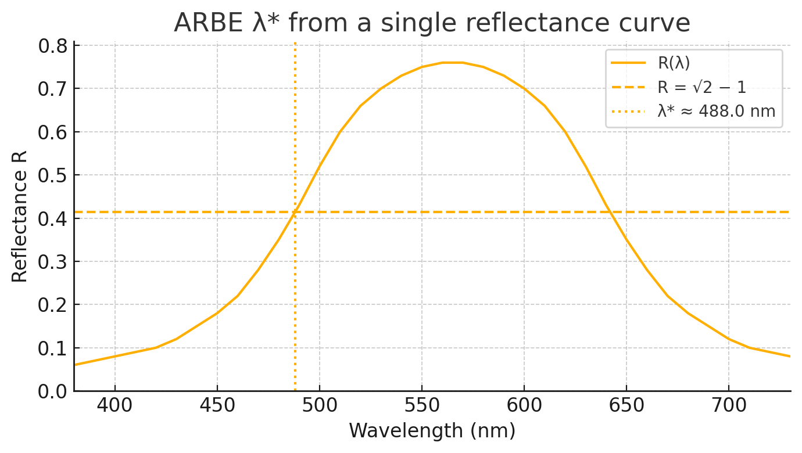

Natürlich! Hier ist eine vollständige, GitHub-optimierte `README.md` für dein Projekt **ARBE λ\***, inklusive:

* Projektbeschreibung
* DOI-Badges
* Quick Start mit CLI & Bild
* Funktionsweise
* Repositoriumsinhalte
* Zitation
* Lizenz
* Kontakt

---

### 📄 Komplette `README.md`

````md
# ARBE λ* Toolkit

[](https://doi.org/10.5281/zenodo.16877145)
[](https://doi.org/10.5281/zenodo.16877146)

**A spectral edge-based colour metric and open toolchain for quality assurance in materials and pigments.**

---

## 🔍 What is ARBE λ*?

**ARBE λ*** (Absorption–Reflection Balance Edge) is a physically grounded scalar that describes the balance point between absorption and reflection of a colour sample in the visible spectrum.

- Computed from spectral reflectance data `R(λ)` (typically from 380 to 730 nm)
- Expressed in **nanometres (nm)** as a single index: **λ\***
- Integrates with **CIELAB** and **HLC** colour spaces
- Designed for **quality control**, **design**, and **pigment development**

> λ\* is defined as the **first rising edge crossing** at  
> `R(λ) = √2 − 1 ≈ 0.4142`  
> using **linear interpolation**.

---

## 🚀 Quick Start — CLI Demo

Use the included CLI script to compute λ\*:

```bash
# Use built-in example spectrum
python demo_lambda_from_single_spectrum.py

# Or provide your own spectrum CSV
python demo_lambda_from_single_spectrum.py path/to/spectrum.csv
````

Output:

```
λ* ≈ 510.0 nm  (R* = √2 − 1 ≈ 0.4142)
```

Plot example:

##  


---

## ⚙️ How It Works

1. Load spectral reflectance R(λ) with 10 nm steps from 380 to 730 nm
2. Search for the **first rising edge** that crosses `R* ≈ 0.4142`
3. Interpolate λ\* precisely between two points if needed
   
[](https://colab.research.google.com/github/HelabHLC/arbe-lambda/blob/main/arbe_lambda_colab_demo_clean.ipynb)


Run the interactive notebook directly in your browser – no setup needed.

> Note: Please upload `arbe_lambda_full_export.csv` manually in Colab if it is not already present in the session.

Run the interactive notebook directly in your browser – no setup needed.

> ℹ️ **Note:** Please upload `arbe_lambda_full_export.csv` manually in Colab if it is not already present in the session.


---

## 📂 Repository Contents

| File / Folder                         | Description                                         |
| ------------------------------------- | --------------------------------------------------- |
| `arbe_lambda.py`                      | Core logic to compute λ\* from spectral data        |
| `demo_lambda_from_single_spectrum.py` | CLI demo script (uses single spectrum)              |
| `example_spectrum.csv`                | Minimal example spectrum file (0–1 scale)           |
| `docs/img/demo_lambda_star.png`       | Demo plot image generated by script                 |
| `arbe_lambda.ipynb`                   | Jupyter/Colab workflow (multi-sample λ\* analysis)  |
| `arbe_lambda_full_export.csv`         | Full dataset (\~13,283 HLC colours with λ\* and Rλ) |
| `paper.md`                            | JOSS submission manuscript                          |
| `tests/test_basic.py`                 | Minimal test to validate λ\* computation            |
| `requirements.txt`                    | Python dependencies                                 |

---

## 🧪 Installation

### Option 1 — Colab (recommended, no install)

\[→ Colab notebook coming soon]


### Option 2 — Local

```bash
pip install -r requirements.txt
```

---

## 🧬 Citation

If you use this toolkit in your work, please cite:

**Woiwod, N. (2025)**
*ARBE λ*: A Spectral Edge-Based Colour Metric and Open Toolchain for Quality Assurance.
Zenodo. [https://doi.org/10.5281/zenodo.16877146](https://doi.org/10.5281/zenodo.16877146)

```bibtex
@article{woiwod2025arbe,
  title={ARBE λ*: A Spectral Edge-Based Colour Metric and Open Toolchain for Quality Assurance},
  author={Woiwod, Norbert},
  year={2025},
  doi={10.5281/zenodo.16877146},
  url={https://doi.org/10.5281/zenodo.16877146}
}
```

---

## ⚖️ License

* **Code**: MIT License
* **Data**: Creative Commons Attribution–NonCommercial 4.0 (CC BY-NC 4.0)

---

## 📬 Contact

Maintainer: **Norbert Woiwod**
ORCID: [0009-0000-0772-0084](https://orcid.org/0009-0000-0772-0084)
GitHub Issues: [github.com/HelabHLC/arbe-lambda/issues](https://github.com/HelabHLC/arbe-lambda/issues)
**GitHub Repository:** [HelabHLC/arbe-lambda](https://github.com/HelabHLC/arbe-lambda)


